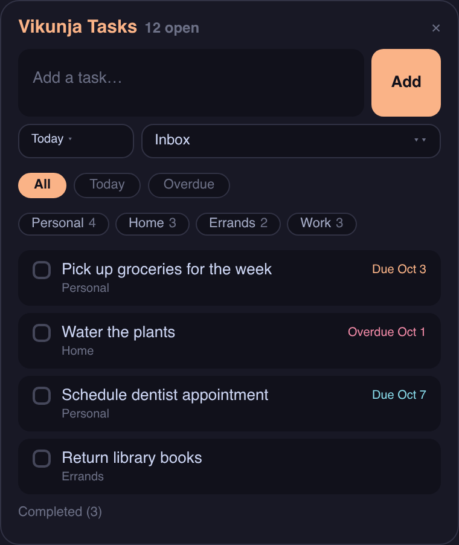

# omarchy-vikunja

An [Omarchy](https://omarchy.org) plugin for [Vikunja](https://vikunja.io), the
self-hosted to-do app. Shows your open-task count in the Hyprland bar with a
due-date warning color, and a click opens a panel to browse and complete tasks
without opening the web UI.

Built and tested against Omarchy's Quickshell-based shell (plugin kinds:
`service`, `bar-widget`, `panel`).

## Features

- Bar widget: open task count. Red when anything is overdue, orange when
  something is due today.

  

- Panel with a compact quick-add flow:

  

  - Two-row task box with list and due-date pickers below it (new tasks
    default to a chosen list, due date optional: today / tomorrow / next
    week / none).
  - All / Today / Overdue filter pills, plus per-list pills with open
    counts.
  - Flat task list, whole card clickable to complete; completed tasks
    fold away into a collapsible section.
  - Due dates color-coded: overdue in red, due today in orange. Hover a
    task card for quick due-date buttons (today / tomorrow / +1 week /
    clear).
- Background service refreshes the cache every 5 minutes; opening the panel
  forces a refresh.

## Setup

1. Generate a Vikunja API token: web UI → Settings → API Tokens, scope
   read+write for tasks and projects.
2. Create the config file (keep it 0600, it holds a token):

   ```bash
   mkdir -p ~/.config/omarchy-vikunja
   cat > ~/.config/omarchy-vikunja/config.json << 'EOF'
   {
     "url": "http://vikunja.example.com",
     "token": "your-token-here"
   }
   EOF
   chmod 600 ~/.config/omarchy-vikunja/config.json
   ```

   Env vars `VIKUNJA_URL` / `VIKUNJA_TOKEN` also work.

3. Install as an Omarchy third-party plugin:

   ```bash
   git clone https://github.com/atxadmin/omarchy-vikunja \
     ~/.config/omarchy/plugins/com.burtoncommand.vikunja
   omarchy plugin enable com.burtoncommand.vikunja
   omarchy restart shell
   ```

## State record

`collect.py --write` writes
`~/.local/state/omarchy/plugins/vikunja/tasks.json`, which the QML widget and
panel read. You can run it standalone to test your config:

```bash
python3 collect.py          # dry run, prints JSON
python3 collect.py --write   # write the state record
```

It also exposes the panel's write actions, which is handy for scripting or
testing your token:

```bash
python3 collect.py --create "Task title" --project 4 --due 2026-01-05 --write
python3 collect.py --set-due 42 --due 2026-01-05 --write   # omit --due to clear
python3 collect.py --toggle 42 --done --write
```

## License

MIT